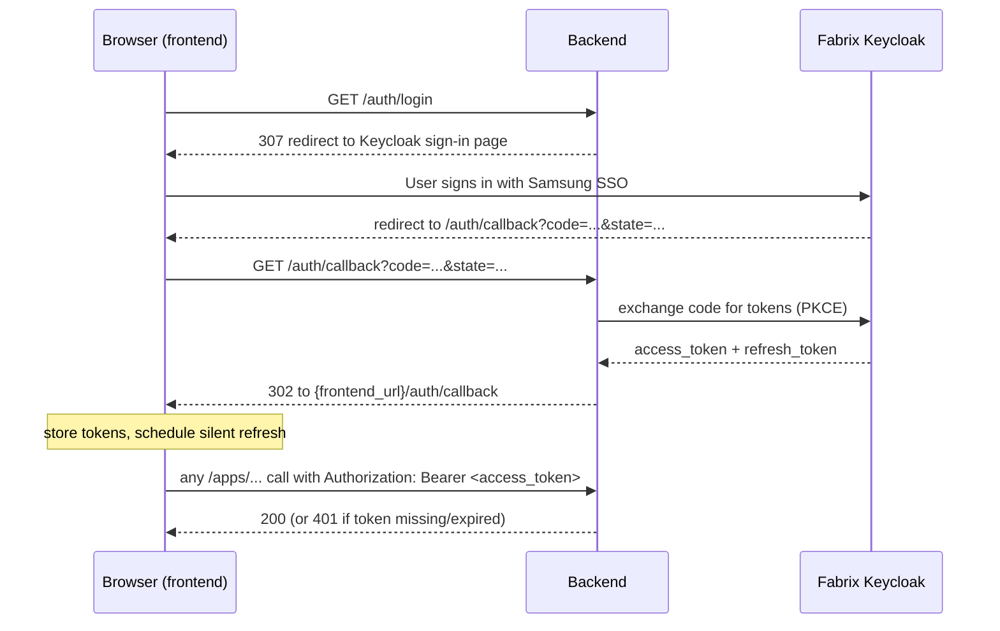

# Authentication

How login works in the COSMO Data Agent Backend, and what the frontend must do to integrate with it.

## The big picture

The platform does **not** have its own accounts or passwords. It delegates login to **Samsung's Fabrix Keycloak SSO** — the same identity provider the `fadk login` CLI command uses. Anyone with a Fabrix account can sign in; nobody else can.

- Identity provider: `https://genai.sec.samsung.net/iam-keycloak/realms/fabrix` (OpenID Connect, Authorization Code + PKCE)
- The backend is a **resource server**: every API request must carry a Fabrix **access token**, which the backend verifies cryptographically (locally, no network call) on every request.
- The user's identity (`user_id`, email, name, permissions) is **read from the token** — the frontend never decides who the user is.



---

## Endpoints

### `GET /auth/login`

Starts the login. **Navigate the browser here** (full page navigation, `window.location.href = "/auth/login"` — not an XHR/fetch call, because it responds with a redirect to the Keycloak sign-in page).

If the user still has a live Keycloak SSO cookie in the browser, the sign-in page is skipped automatically and they land on the callback without typing anything.

### `GET /auth/callback`

Keycloak redirects the browser here after sign-in. The backend exchanges the one-time code and hands the browser back to the frontend with a **302 redirect**, carrying the tokens in the **URL fragment** (never sent to servers, so they stay out of logs and `Referer` headers):

```
302 Location:
{auth.frontend_url}/auth/callback#access_token=...&refresh_token=...&expires_in=4200&refresh_expires_in=14854
```

The frontend route reads `window.location.hash`, stores the tokens, and should then clear the fragment (`history.replaceState`) so tokens don't linger in the address bar / history.

The target comes from config: `auth.frontend_url` (env `AUTH_FRONTEND_URL`), e.g. `http://localhost:3000` in dev. **When it is empty** the endpoint falls back to returning the tokens as `TokenResponse` JSON in the tab — handy for manual/dev use without a frontend.

**Errors also redirect** (when `frontend_url` is set), so the user never sees a dead-end JSON page:

```
{auth.frontend_url}/auth/callback#error=<code>
```

| `error` code | Meaning | Frontend reaction |
|---|---|---|
| `login_expired` | Login state expired (>10 min) or backend restarted mid-login | Send the user to `/auth/login` again |
| `invalid_request` | Callback hit without `code`/`state` | Send the user to `/auth/login` again |
| anything else | Keycloak's own error code passed through (e.g. `access_denied`) | Show a "sign-in failed" message with retry |

(Without `frontend_url` these are a `401`/`400` JSON response instead.)

### `POST /auth/refresh`

Silent renewal — no browser redirect, call it from JS:

```
POST /auth/refresh
Content-Type: application/json

{ "refresh_token": "eyJhbGciOiJIUzUxMiIs..." }
```

Returns the same `TokenResponse` shape with a **new** `access_token` **and a new** `refresh_token` — always replace both. `401` means the refresh token is dead → full re-login via `/auth/login`.

Use this endpoint rather than calling Keycloak's token endpoint directly from the browser — Keycloak's CORS policy only allows its own origin, so a direct call from your app's origin would be blocked. The backend proxies it for you.

### `GET /auth/me`

Requires `Authorization: Bearer <access_token>`. Returns who the token belongs to:

```json
{
  "id": "05dc3850-3bdf-4225-83a2-d45729a17f73",
  "email": "m.alenova@samsung.com",
  "name": "Marzhan Alenova",
  "tenant_id": "1",
  "permissions": ["perm_user", "perm_create_lab", "..."],
  "expires_at": 1786342499
}
```

**`id` is the `user_id`** you must use in all API paths (see below). `expires_at` is a unix timestamp of token expiry. `permissions` can be used to show/hide UI features. This endpoint is also the standard "am I logged in?" probe on app startup.

---

## Calling the protected APIs

Every `/apps/...` endpoint (sessions and run) now requires the header:

```
Authorization: Bearer <access_token>
```

and the `{user_id}` in the path **must be the `id` from `/auth/me`**. The backend compares the path against the verified token on every request:

| Response | Meaning | What the frontend should do |
|---|---|---|
| `401 Unauthorized` | No token, malformed, or **expired** | Try `/auth/refresh` once; if that also 401s → redirect to `/auth/login` |
| `403 Forbidden` | Token is valid but path `user_id` ≠ token's user | Bug in frontend — always take user_id from `/auth/me`, never hardcode or cache across logins |
| `200` | OK | — |

`GET /health` and all `/auth/*` endpoints (except `/auth/me`) stay public.

Example:

```js
const res = await fetch(`/apps/users/${user.id}/sessions`, {
  headers: { Authorization: `Bearer ${accessToken}` },
});
```

---

## Token lifetimes and the refresh strategy

Two tokens, two clocks (values come from Keycloak; read them from the response, don't hardcode):

| Token | Typical lifetime | Purpose |
|---|---|---|
| `access_token` | ~70 min (`expires_in: 4200`) | Sent with every API call |
| `refresh_token` | ~4 h sliding (`refresh_expires_in`) | Only used to get new access tokens |

Recommended frontend logic:

1. **On app startup:** if you have a stored access token, call `/auth/me`. `200` → logged in. `401` → try `/auth/refresh`; if that fails → show login.
2. **Proactive refresh:** set a timer for `expires_in - 60` seconds and call `/auth/refresh`. Replace both tokens, reset the timer.
3. **Reactive fallback:** on any API `401`, try one `/auth/refresh` and retry the original request once; if refresh fails, redirect to `/auth/login`.
4. **After long inactivity** (refresh token dead): the user goes through `/auth/login` again — and thanks to the Keycloak SSO cookie this is usually just a redirect flicker, no password screen.

Storage: prefer keeping tokens in memory (a JS variable / state store) with the refresh token as the only thing persisted, or use `sessionStorage`. Avoid `localStorage` for the access token if you can — anything XSS-readable is a risk. These are bearer tokens: whoever holds one *is* that user.

Logout: currently just drop the tokens client-side and route to your login screen. (A backend `/auth/logout` that also kills the Keycloak SSO session can be added if you need "sign out everywhere".)

---

## What identity data you get

The access token is a JWT issued by Keycloak. The backend verifies its signature with Keycloak's published public keys and reads the claims — the important ones being `sub` (stable user UUID → `user_id`), `user_email`, `name`/`en_name`, `tenant_id`, and `permission[]`. The frontend doesn't need to decode the JWT itself — `/auth/me` exposes everything relevant. (Decoding it client-side for display is fine; just never *trust* client-side decoding for security decisions.)

---

## Dev mode (no login)

In `config.yaml`:

```yaml
auth:
  enabled: false
```

turns authentication off: no header needed, every request runs as a stub user with `user_id = "local-dev"`. Useful for local frontend development without VPN/SSO access. **Must be `true` in any shared or production deployment.**

Other knobs (env vars `AUTH_ENABLED`, `AUTH_ISSUER`, `AUTH_CLIENT_ID`, `AUTH_REDIRECT_URI`, `AUTH_FRONTEND_URL` override the YAML): `redirect_uri` is normally derived from the incoming request, but must be set explicitly when the backend sits behind a reverse proxy, and the resulting URL must be whitelisted on the Keycloak client. `frontend_url` is where `/auth/callback` redirects with the tokens — set it per environment to the frontend's origin.

---

## Backend implementation map (for reference)

| Piece | File |
|---|---|
| Token verification (JWKS) + PKCE flow + refresh proxy | `data_agent/services/auth_service.py` |
| `/auth/*` endpoints | `data_agent/routers/auth.py` |
| `get_current_user` (401) and `require_path_user` (403) dependencies | `data_agent/dependencies.py` |
| Route protection (router-level dependency) | `data_agent/routers/session.py`, `data_agent/routers/runner.py` |
| Config (`auth:` section) | `common/config.py`, `config.yaml` |
| Schemas (`CurrentUser`, `TokenResponse`, …) | `data_agent/schemas/auth.py` |

Note for backend devs: model calls to the Fabrix API currently still run under the server's own `fadk login` credential (`auth.json`) — per-user model calls are a planned follow-up; the per-request user token is already captured in the `current_fabrix_token` contextvar for that purpose.
