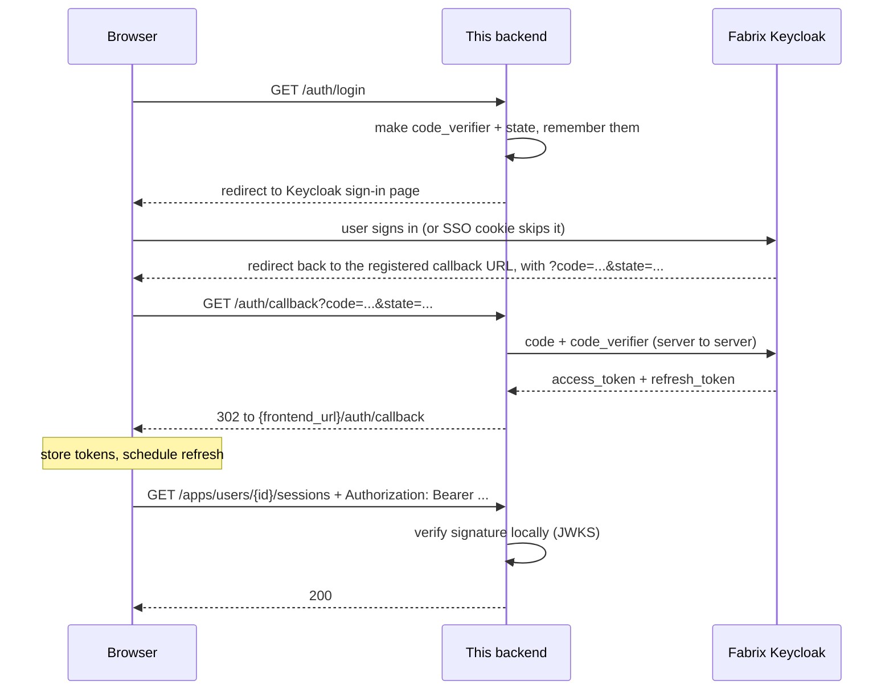

# Authentication 2.0

Everything about login in the COSMO Data Agent Backend: what exists in the code, why one specific thing (the redirect URI) is not ours to decide, how to test the whole flow on your laptop, and what production needs.

This supersedes [AUTHENTICATION.md](AUTHENTICATION.md) — it covers the same system plus the deployment reality that document was missing.

---

## Contents

1. [The idea in five sentences](#1-the-idea-in-five-sentences)
2. [Concepts you need](#2-concepts-you-need)
3. [What is implemented](#3-what-is-implemented)
4. [The one rule that breaks everything: the redirect URI](#4-the-one-rule-that-breaks-everything-the-redirect-uri)
5. [Testing it on your local machine](#5-testing-it-on-your-local-machine)
6. [Troubleshooting: symptom → cause → fix](#6-troubleshooting-symptom--cause--fix)
7. [What the frontend has to do](#7-what-the-frontend-has-to-do)
8. [Production deployment](#8-production-deployment)
9. [Known gaps and follow-ups](#9-known-gaps-and-follow-ups)

---

## 1. The idea in five sentences

This platform has no accounts and no passwords of its own. Login is delegated entirely to **Samsung's Fabrix Keycloak** — the same identity provider the `fadk login` CLI command uses, so anyone with a Fabrix account can sign in and nobody else can. After signing in, the user's browser holds an **access token**, and every API call carries it in an `Authorization: Bearer …` header. The backend verifies that token **cryptographically and locally** on every request — no network call, no session table, no cookie. Who the user is comes out of the token, never out of the request body or the URL.

---

## 2. Concepts you need

You can read the rest of this document without knowing OAuth, as long as these five terms are clear.

**Keycloak** — the login server, at `https://genai.sec.samsung.net/iam-keycloak`. It owns users and passwords. Ours is the realm (tenant) named `fabrix`.

**Client** — how an application identifies itself to Keycloak. Ours is `fabrix-adk`, the same client the `fadk` CLI uses. A client carries settings that Keycloak enforces, and one of them causes almost all the trouble in this document: the list of allowed return addresses (see §4).

**Access token** — a signed text blob (a JWT) that proves "this is user X, valid until time T". Anyone holding it *is* that user, so treat it like a password. It expires after roughly 70 minutes.

**Refresh token** — a second token, only usable to obtain a new access token without the user typing anything. Lives ~4 hours of inactivity.

**Authorization Code + PKCE** — the standard sign-in dance, in plain terms:

1. The backend invents a random secret (`code_verifier`), hashes it, and sends the user to Keycloak with the **hash** in the URL.
2. The user signs in at Keycloak. The backend never sees their password.
3. Keycloak sends the browser back to the backend with a one-time `code`.
4. The backend calls Keycloak directly: "here is the code, and here is the **original secret** that matches the hash I sent". Keycloak checks it and returns the tokens.

The point of step 4 is that a `code` stolen in transit is useless without the secret, which never left the backend's memory.

---

## 3. What is implemented

### The flow, end to end



### Endpoints

| Endpoint | Auth required | What it does |
|---|---|---|
| `GET /health` | no | Liveness probe |
| `GET /auth/login` | no | Redirects the browser to the Keycloak sign-in page. **Must be a real browser navigation**, not `fetch`/XHR |
| `GET /auth/callback` | no | Where Keycloak returns the user; exchanges the code for tokens |
| `GET /callback` | no | The *same handler* at a second path — needed because Keycloak only trusts specific URLs (§4). Hidden from `/docs` |
| `POST /auth/refresh` | no (needs a refresh token in the body) | Silent renewal, no browser involved |
| `GET /auth/me` | **yes** | Who the presented token belongs to |
| `GET /apps/users/{user_id}/sessions` | **yes** | List sessions |
| `POST /apps/users/{user_id}/sessions` | **yes** | Create session |
| `GET`/`DELETE /apps/users/{user_id}/sessions/{session_id}` | **yes** | Read / delete session |
| `POST`/`PATCH /apps/users/{user_id}/sessions/{session_id}/title` | **yes** | Generate / rename title |
| `POST /apps/users/{user_id}/sessions/{session_id}/run` | **yes** | Run the agent |

### Responses you will see

`GET /auth/me`:

```json
{
  "id": "05dc3850-3bdf-4225-83a2-d45729a17f73",
  "email": "m.alenova@samsung.com",
  "name": "Marzhan Alenova",
  "tenant_id": "1",
  "permissions": ["perm_user", "perm_create_lab", "..."],
  "expires_at": 1786342499
}
```

`id` is the **`user_id` for every API path**. `expires_at` is a Unix timestamp. `permissions` comes straight from the token and can drive UI visibility.

`POST /auth/refresh` and (in dev) `GET /auth/callback`:

```json
{
  "access_token": "eyJ...",
  "refresh_token": "eyJ...",
  "expires_in": 4200,
  "refresh_expires_in": 14854,
  "token_type": "Bearer"
}
```

### The two guards

| Guard | Where | Rejects with |
|---|---|---|
| `get_current_user` | [dependencies.py:59](data_agent/dependencies.py#L59) | **401** — no token, malformed token, wrong signature, or expired |
| `require_path_user` | [dependencies.py:86](data_agent/dependencies.py#L86) | **403** — token is valid, but `{user_id}` in the path is somebody else |

`require_path_user` is attached at **router level** in [session.py:13](data_agent/routers/session.py#L13) and [runner.py:13](data_agent/routers/runner.py#L13), so every current and future `/apps/...` route is protected by default — you cannot forget to add it to a new endpoint.

### How verification works

[auth_service.py:49](data_agent/services/auth_service.py#L49) fetches Keycloak's **public keys** (JWKS) once, caches them, and then verifies every token locally: RS256 signature, matching issuer, expiry with 30 seconds of leeway. No network call per request, so it costs microseconds.

Audience (`aud`) is deliberately **not** checked: Keycloak stamps it per client, and we accept any client of the `fabrix` realm — the CLI, the frontend, this backend — so a token from `fadk login` works against this API. That is what makes local testing easy.

### Identity for model calls

[dependencies.py:82](data_agent/dependencies.py#L82) stores the caller's token in the `current_fabrix_token` contextvar. Nothing reads it yet — model calls still use the server's own `fadk login` credential. It is the seam for per-user model calls (Route A in [DEPLOYMENT.md](DEPLOYMENT.md)), postponed on purpose.

### Dev mode: no login at all

```yaml
auth:
  enabled: false
```

Every request then runs as a stub user with `user_id = "local-dev"` and no header is needed. For frontend work without VPN. **Must be `true` anywhere shared.**

### Configuration

| YAML key | Env var | Meaning |
|---|---|---|
| `auth.enabled` | `AUTH_ENABLED` | `false` disables auth entirely (dev only) |
| `auth.issuer` | `AUTH_ISSUER` | Keycloak realm URL |
| `auth.client_id` | `AUTH_CLIENT_ID` | `fabrix-adk` |
| `auth.redirect_uri` | `AUTH_REDIRECT_URI` | Where Keycloak returns the browser — **see §4, this is not a free choice** |
| `auth.frontend_url` | `AUTH_FRONTEND_URL` | Where `/auth/callback` hands the tokens to; empty → tokens as JSON in the browser tab |

Env vars override the YAML ([config.py:11](common/config.py#L11)).

### File map

| Piece | File |
|---|---|
| Token verification, PKCE, refresh proxy | [data_agent/services/auth_service.py](data_agent/services/auth_service.py) |
| `/auth/*` and `/callback` endpoints | [data_agent/routers/auth.py](data_agent/routers/auth.py) |
| 401 / 403 guards | [data_agent/dependencies.py](data_agent/dependencies.py) |
| Route protection | [data_agent/routers/session.py](data_agent/routers/session.py), [data_agent/routers/runner.py](data_agent/routers/runner.py) |
| Schemas | [data_agent/schemas/auth.py](data_agent/schemas/auth.py) |
| Config | [common/config.py](common/config.py), [config.yaml](config.yaml) |
| Tests | [tests/routers/test_auth.py](tests/routers/test_auth.py), [tests/services/test_auth_service.py](tests/services/test_auth_service.py) |

---

## 4. The one rule that breaks everything: the redirect URI

**Read this section before touching `redirect_uri`. Most "login is broken" reports are this.**

### What the rule is

Keycloak stores, for each client, a **list of allowed return addresses** ("Valid redirect URIs"). After sign-in it will send the user — and the one-time code — only to a URL on that list. Anything else is refused before any sign-in page appears.

This is a security rule, not a limitation: without it, an attacker could craft a login link that delivered your users' codes to their own server.

### Why you cannot fix it in this repository

That list lives **inside the Keycloak admin console** for the `fabrix` realm. It is not in this code, not in `config.yaml`, not in the Docker image. Changing `redirect_uri` here only changes what we *ask for*; Keycloak still checks the request against its own list. Adding an entry requires someone with realm admin rights — the **FabriX platform team**.

### What is registered today

The `fabrix-adk` client is the CLI's client, and the CLI's callback URL is a **hardcoded constant** in the FabriX package (`fabrix/common/auth/pkce_storage.py`):

```python
_DEFAULT_KEYCLOAK_REDIRECT_URI = "http://localhost:53862/callback"
```

It is a fixed port, not a random one. Because `fadk login` works, we know this exact URL is registered — and it is the only loopback URL we can count on.

Two consequences shape everything below:

- **Local dev** must run the backend on port **53862** and answer at the bare path **`/callback`**, borrowing the CLI's registered URL. That is why [auth.py](data_agent/routers/auth.py) registers the same callback handler twice — at `/auth/callback` and at `/callback`.
- **Production cannot borrow it**, because a deployed server is not on the user's `localhost`. Production needs its own registration (§8).

### What still works without any registration

Only the browser sign-in leg depends on the list:

| Capability | Needs a registered redirect URI? |
|---|---|
| Verifying tokens — `/auth/me`, every `/apps/...` route | **No.** The public keys are public; verification is local |
| `POST /auth/refresh` | **No.** No browser redirect is involved |
| `GET /auth/login` → `/auth/callback` | **Yes** |

So a backend can serve its entire authenticated API before anyone registers anything — you just need a token from somewhere else (e.g. your local `fadk login`).

### Checking whether a URL is registered, in 10 seconds

Paste this in a browser, replacing `<client>` and the URL-encoded URI:

```
https://genai.sec.samsung.net/iam-keycloak/realms/fabrix/protocol/openid-connect/auth?response_type=code&client_id=<client>&redirect_uri=<url-encoded-uri>&scope=openid+profile+email&code_challenge=E9Melhoa2OwvFrEMTJguCHaoeK1t8URWbuGJSstw-cM&code_challenge_method=S256
```

- Sign-in page appears, or you are redirected instantly → **registered**.
- Keycloak page saying *"Invalid parameter: redirect_uri"* → **not registered**.

---

## 5. Testing it on your local machine

### Before you start

- Be on the **corporate network / VPN** — `genai.sec.samsung.net` is internal.
- Make sure nothing else holds port 53862. In particular **`fadk login` uses the same port**, so the two cannot run at once: stop the backend before running `fadk login`, and vice versa.

### Step 1 — config

[config.yaml](config.yaml) should read:

```yaml
auth:
  enabled: true
  issuer: https://genai.sec.samsung.net/iam-keycloak/realms/fabrix
  client_id: fabrix-adk
  redirect_uri: "http://localhost:53862/callback"
  frontend_url: ""      # empty = show the tokens as JSON in the tab (best for backend testing)
```

Setting `frontend_url: ""` matters: with `http://localhost:3000` there, a successful login ends on your frontend, and if no frontend is running you get a browser error page that **looks** like a failure but is not.

### Step 2 — run the backend on port 53862

Do not edit `server_port` in the file; override it for this run only (PowerShell):

```powershell
$env:SERVER_PORT = "53862"
python -m data_agent
```

Do **not** use `--reload` while testing login: the pending-login state is in memory ([auth_service.py:47](data_agent/services/auth_service.py#L47)), and a reload between the two steps produces a misleading `login_expired`.

### Step 3 — open the login in a real browser tab

```
http://localhost:53862/auth/login
```

**Type it in the address bar.** Do not use Swagger `/docs` "Try it out" and do not use `curl` for this step — see the box below.

> **Why Swagger cannot test `/auth/login`**
> "Try it out" sends an XHR. The endpoint answers with a redirect to Keycloak, the browser follows it, and Keycloak — quite correctly — sends no CORS headers for your `localhost` origin, so the browser blocks the response and Swagger prints "Failed to fetch". The endpoint is fine; the tool is wrong for the job. The `allow_origins=["*"]` setting in [\_\_main\_\_.py](data_agent/__main__.py) is *our* server's policy and has no effect on Keycloak's.

### Step 4 — what success looks like

You either see the Samsung sign-in page, or nothing at all if your browser still holds a Keycloak SSO cookie (the redirect is instant — that is normal, not a failure). Then the tab lands back on your backend and shows:

```json
{"access_token":"eyJ...","refresh_token":"eyJ...","expires_in":4200,"refresh_expires_in":14854,"token_type":"Bearer"}
```

That JSON is the proof the whole round trip worked: the login URL was accepted, the code came back, and the backend exchanged it for tokens.

### Step 5 — use the token

Copy `access_token`, then (PowerShell):

```powershell
$t = "eyJ..."
curl.exe -s -H "Authorization: Bearer $t" http://localhost:53862/auth/me
```

Take `id` from that response and call a protected route with it:

```powershell
curl.exe -s -H "Authorization: Bearer $t" http://localhost:53862/apps/users/<id>/sessions
```

Then confirm the guards actually guard:

| Try this | Expected |
|---|---|
| The same call with **no** `Authorization` header | `401` |
| The same call with `<id>` replaced by any other user id | `403` |
| `/auth/me` with a token that has expired | `401` |

### Step 6 — refresh

```powershell
curl.exe -s -X POST http://localhost:53862/auth/refresh -H "Content-Type: application/json" -d "{\"refresh_token\":\"eyJ...\"}"
```

Returns a new access token **and a new refresh token** — always store both.

### Shortcut: testing without doing the login flow at all

You already have a valid token in `auth.json` from `fadk login` (`~/.config/fadk/<tenant>/auth.json`). Because the backend accepts any `fabrix` realm token, you can paste its `access_token` straight into the `Authorization` header and exercise every protected endpoint — including from Swagger, which handles bearer headers fine. Only `/auth/login` itself needs the browser.

---

## 6. Troubleshooting: symptom → cause → fix

| What you see | What it actually means | Fix |
|---|---|---|
| Swagger: "Failed to fetch" on `/auth/login` | Expected. XHR cannot follow a redirect to Keycloak (no CORS) | Use the browser address bar |
| Keycloak page: *"Invalid parameter: redirect_uri"* | The URL we asked for is not on the client's allowed list | Use `http://localhost:53862/callback` locally; for other environments see §8 |
| Browser: "can't reach this page", address bar shows `…/callback?code=…` | Keycloak accepted everything — **the login worked** — but nothing is listening on that host/port | Run the backend on the port in `redirect_uri` (53862 locally) |
| Browser: "can't reach this page" at `localhost:3000` and the URL contains `#access_token=…` | Also success. The backend handed off to `frontend_url`, which is not running | Start the frontend, or set `frontend_url: ""` |
| Browser: "can't reach this page" for `genai.sec.samsung.net` | Not on VPN / DNS failure | Connect to the corporate network |
| `{"detail":"Unknown or expired login state…"}` or `#error=login_expired` | The backend forgot the pending login: server restarted (`--reload`), more than 10 minutes elapsed, or the callback hit a different process/replica | Retry the login; do not use `--reload`; keep one worker |
| `401` on `/apps/...` | Missing, malformed, or expired token | Call `/auth/refresh`; if that also 401s, log in again |
| `403` on `/apps/...` | Token is valid but the `{user_id}` in the path is somebody else | Always take `user_id` from `/auth/me` |
| `#error=access_denied` | Keycloak's own error, passed through (user cancelled, no permission) | Show a "sign-in failed" message |

---

## 7. What the frontend has to do

**Start login:** `window.location.href = "/auth/login"` — a full navigation, never `fetch`.

**Receive tokens:** the backend redirects to `{frontend_url}/auth/callback#access_token=…&refresh_token=…&expires_in=…&refresh_expires_in=…`. Read `window.location.hash`, store the tokens, then clear the fragment with `history.replaceState` so they do not sit in the address bar or history. Tokens travel in the **fragment** on purpose: browsers never send fragments to servers, so they stay out of access logs and `Referer` headers.

**Errors arrive the same way:** `{frontend_url}/auth/callback#error=<code>` with `login_expired`, `invalid_request`, or a Keycloak code such as `access_denied`. The first two mean "send the user back to `/auth/login`".

**Call the API:**

```js
const res = await fetch(`/apps/users/${user.id}/sessions`, {
  headers: { Authorization: `Bearer ${accessToken}` },
});
```

`user.id` must come from `/auth/me`. Never hardcode it and never reuse one across logins — that is what produces 403s.

**Keep the session alive:**

1. On startup, if you have a stored token, call `/auth/me`. `200` → logged in. `401` → try `/auth/refresh`; if that fails, show login.
2. Proactively refresh at `expires_in - 60` seconds. Replace **both** tokens and reset the timer.
3. On any `401`, try one refresh and retry the request once; if the refresh fails, go to `/auth/login`.
4. Use `/auth/refresh` rather than calling Keycloak directly — Keycloak's CORS policy blocks browser calls from your origin, which is exactly why this proxy endpoint exists.

**Storage:** prefer keeping the access token in memory and persisting only the refresh token, or use `sessionStorage`. Anything readable by XSS is a risk: whoever holds a bearer token *is* that user.

**Logout:** currently client-side only — drop the tokens and route to your login screen. A backend `/auth/logout` that also ends the Keycloak SSO session can be added if "sign out everywhere" is needed.

---

## 8. Production deployment

Full container instructions live in [DEPLOYMENT.md](DEPLOYMENT.md). This section is only the authentication part.

### What changes, and what does not

The container keeps port **9999** (`EXPOSE 9999`, `-p 9999:9999`). Port 53862 is a local-dev borrow of the CLI's registered URL and means nothing in a container. What Keycloak validates is the **public URL the browser lands on**, not any internal port, so what matters is:

```bash
-e AUTH_REDIRECT_URI=https://<backend-host>/auth/callback
-e AUTH_FRONTEND_URL=https://<frontend-host>
-e AUTH_ENABLED=true
```

Always set `AUTH_REDIRECT_URI` explicitly. Left empty, the backend derives it from the incoming request, which is wrong behind a TLS-terminating proxy (it would produce `http://` and an internal hostname).

### The blocking item, and how to unblock it

`https://<backend-host>/auth/callback` is **not** on the client's allowed list. Someone has to add it, and that someone is the FabriX platform team. Ask them for a **dedicated client** rather than an addition to `fabrix-adk` — `fabrix-adk` is the shared CLI client and they may reasonably decline to add per-environment URLs to it.

Message you can send, with the two hostnames filled in:

> **Subject: Keycloak client for COSMO Data Agent Backend**
>
> We run a backend service (custom FastAPI, deployed as a container) that signs users in against the `fabrix` realm with OpenID Connect Authorization Code + PKCE (S256), exactly like `fadk login`. The resulting access tokens are also the bearer tokens for our own REST API, which verifies them locally against the realm JWKS.
>
> We would like a **dedicated public client** for this service rather than reusing `fabrix-adk`:
>
> - Realm: `fabrix`
> - Client ID: `cosmo-data-agent` (or whatever naming you prefer)
> - Client type: **public** (no client secret), Standard Flow enabled, PKCE required, method `S256`
> - Valid redirect URI: `https://<backend-host>/auth/callback`
> - Web origins: `https://<frontend-host>`
> - Scopes: `openid profile email`
>
> If policy requires a confidential client with a secret instead, please say so — we will add secret handling on our side.
>
> If a dedicated client is not possible, the fallback ask is to add `https://<backend-host>/auth/callback` to the existing `fabrix-adk` client's valid redirect URIs.

When they answer:

- **New `client_id`** → set `AUTH_CLIENT_ID` as well as `AUTH_REDIRECT_URI`. No code change.
- **Confidential client (a secret was issued)** → **needs a code change first.** [auth_service.py](data_agent/services/auth_service.py) sends `client_id` only on both the token exchange and the refresh call; Keycloak rejects a confidential client without its secret. Small change plus a config field — ask before deploying.
- **Refused entirely** → the browser login stays localhost-only and the frontend must obtain tokens another way. Everything else in the API keeps working.

The URI you give them must be **byte-identical** to `AUTH_REDIRECT_URI` — scheme, host, port, path, trailing slash. Keycloak matches exactly, and the same string is replayed during the token exchange ([auth.py](data_agent/routers/auth.py)). Register the `/auth/callback` path; the bare `/callback` alias exists only for the CLI's dev URL.

### Deploy before registration lands

Do it — only `/auth/login` is affected. Deploy, then smoke-test with a token from your local `fadk login`:

```bash
curl -s -H "Authorization: Bearer <token>" https://<backend-host>/auth/me
```

`200` there proves auth works end to end in production, without any registration at all.

### Run a single worker

The PKCE verifier is held in a dict inside `AuthService` ([auth_service.py:47](data_agent/services/auth_service.py#L47)), so `/auth/login` and its `/auth/callback` **must reach the same process**:

- One uvicorn worker — the current entry point runs one; do not add `--workers`.
- More than one replica → sticky sessions at the load balancer, or logins fail intermittently with `login_expired`.
- Restarts and rolling deploys drop in-flight logins. Users retry and succeed; it explains sporadic `login_expired` right after a deploy.

Moving that state into a signed cookie or Redis removes the constraint and is the prerequisite for scaling out.

### Checklist

- [ ] `AUTH_ENABLED=true`.
- [ ] `AUTH_REDIRECT_URI` set explicitly, never left at the dev value `http://localhost:53862/callback`.
- [ ] That exact URI registered on the Keycloak client — or `/auth/login` accepted as non-functional for now.
- [ ] `AUTH_FRONTEND_URL` points at this environment's frontend origin.
- [ ] `AUTH_CLIENT_ID` set if a dedicated client was issued.
- [ ] Single worker; sign-in traffic not spread across replicas without sticky sessions.
- [ ] Container can reach `genai.sec.samsung.net` (JWKS fetch and token exchange).
- [ ] `curl /auth/me` with a real token returns `200`.
- [ ] CORS origins reviewed (see §9).

---

## 9. Known gaps and follow-ups

Honest list of what is not done. None of these block local testing.

| Gap | Impact | Notes |
|---|---|---|
| No confidential-client support | Blocks prod **if** the platform team issues a client secret | `client_secret` is not sent anywhere in [auth_service.py](data_agent/services/auth_service.py) |
| Login state is in-process | Cannot scale out the sign-in leg | Signed cookie or Redis would fix it |
| `allow_origins=["*"]` with `allow_credentials=True` | Browsers reject that combination for credentialed requests; too open for production | [\_\_main\_\_.py](data_agent/__main__.py). Bearer-header calls are unaffected today, so it has not surfaced yet |
| No `/auth/logout` | "Sign out everywhere" is not possible; logout is client-side only | The Keycloak SSO session survives |
| Model calls still use the server's `fadk login` credential | The container has no such credential — first model call fails | `current_fabrix_token` is already populated per request; see Route A in [DEPLOYMENT.md](DEPLOYMENT.md) |
| Audience (`aud`) not verified | Any `fabrix` realm token is accepted, including CLI tokens | Deliberate — it is what makes local testing easy. Tighten only if a dedicated client makes it possible |
