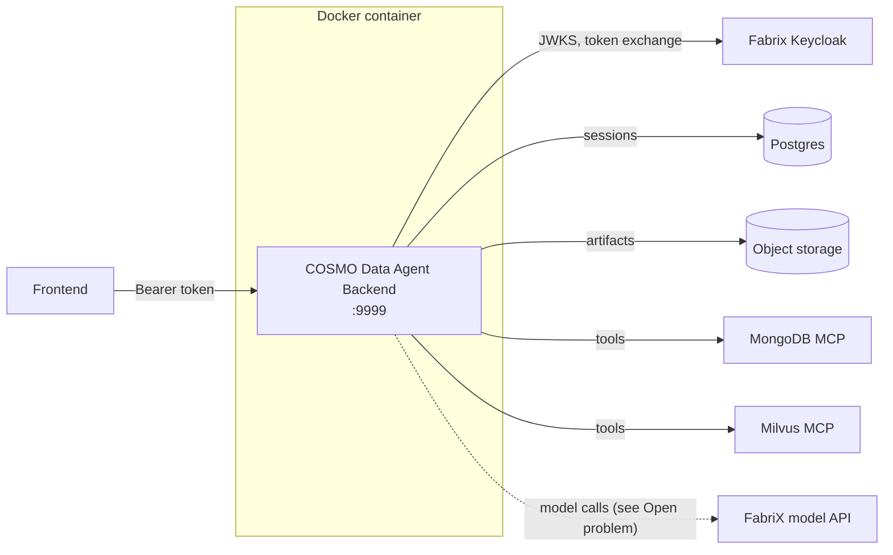

# Deployment

How to build and run the COSMO Data Agent Backend as a Docker container, what must be configured at runtime, and the one open problem (FabriX model credentials) with its possible solutions.

## The big picture

This service is a **custom FastAPI backend** that embeds FabriX ADK agents. It is *not* a standard `fadk` agent workspace: it serves its own REST API (`/auth`, `/apps`, `/health`), owns its session store (Postgres) and artifact storage (S3-compatible object storage), and calls FabriX only for model inference and MCP tools.

Because of that, it deploys like any other containerized service — the same manner as `cosmo-milvus-mcp-server` — **not** through the FabriX `fadk build` / AgentOps flow (see [Why not `fadk build`?](#route-c-fadk-build--agentops-deploy)).



Everything on the right side must be reachable **from inside the container** — see [Networking](#networking).

## Prerequisites

- Docker on the build/deploy machine, with access to the internal registry (`docker-remote.bart.sec.samsung.net`).
- A pip index that serves `fabrix-adk` (see [requirements_py313_prod.txt](requirements_py313_prod.txt)). The public PyPI does not have it — if the build fails on `fabrix-adk`, apply the same internal pip index configuration your team uses for other FabriX builds.
- Network access from the container to: Fabrix Keycloak (token verification), the session Postgres DB, the object storage endpoint, both MCP servers, and the FabriX model API.

## Build the image

### Deploy folder layout

Same layout as the milvus MCP server deployment: a folder containing the repository checkout, the production `config.yaml`, and the Docker files copied up from the repo.

```
deploy/
├── Dockerfile          # copied from da-backend/Dockerfile
├── .dockerignore       # copied from da-backend/.dockerignore  (must sit at context root!)
├── config.yaml         # production config — see Configuration below
└── da-backend/         # this repository
```

> `.dockerignore` is only honored at the **root of the build context**. If it stays inside `da-backend/`, the local `venv/` and `.git/` get copied into the image and bloat it by hundreds of MB.

### Dockerfile

The [Dockerfile](Dockerfile) is versioned in this repo:

```dockerfile
FROM docker-remote.bart.sec.samsung.net/python:3.13.13

COPY ./da-backend /home/work/da-backend
COPY ./config.yaml /home/work/da-backend/config.yaml

WORKDIR /home/work/da-backend
RUN python -m pip install -r requirements_py313_prod.txt --no-cache-dir

EXPOSE 9999

CMD ["python", "-m", "data_agent", "-c", "/home/work/da-backend/config.yaml"]
```

The entry point is `python -m data_agent`; the `-c` flag is parsed by `load_config()` in [common/config.py](common/config.py), exactly like `python -m milvus_mcp -c ...`.

### Build

From the `deploy/` folder:

```bash
docker build -t cosmo-data-agent .
```

## Configuration

Configuration is loaded in two layers, later wins:

1. The `config.yaml` passed via `-c` (baked into the image at build time).
2. **Environment variables** (`docker run -e ...`), which override individual keys at container start.

### Rule: no secrets in the image

Anything `COPY`-ed into the image lives in a layer forever — even if a later layer overwrites the file, `docker history`/`docker save` can recover it. Therefore:

- The production `config.yaml` in the deploy folder must contain **no credentials** (no object-storage keys).
- Secrets are injected at runtime via environment variables.
- The repo's own [config.yaml](config.yaml) (development values) is copied in by `COPY ./da-backend` before being overwritten — keep development secrets out of it too, or add `da-backend/config.yaml` to the deploy folder's `.dockerignore`.

### Environment variable reference

Every variable maps to a `config.yaml` key (see `_ENV_MAP` in [common/config.py](common/config.py)):

| Variable | Config key | Notes |
|---|---|---|
| `SERVER_PORT` | `server_port` | Default in config: `9999` |
| `LAB_ID` | `lab_id` | FabriX Lab ID |
| `TENANT_CODE` | `tenant_code` | FabriX tenant |
| `BASE_URL` | `base_url` | FabriX platform base URL |
| `OTEL_ENABLED` | `otel_enabled` | `"true"` / `"false"` |
| `LOG_LEVEL` | `log_level` | e.g. `INFO` |
| `MONGODB_MCP_HOST` / `MONGODB_MCP_PORT` | `mongodb_mcp.*` | **Must not be `localhost`** — see Networking |
| `MILVUS_MCP_HOST` / `MILVUS_MCP_PORT` | `milvus_mcp.*` | **Must not be `localhost`** — see Networking |
| `AUTH_ENABLED` | `auth.enabled` | Keep `true` in production; `false` is a local-dev stub |
| `AUTH_ISSUER` | `auth.issuer` | Fabrix Keycloak realm URL |
| `AUTH_CLIENT_ID` | `auth.client_id` | `fabrix-adk` |
| `AUTH_REDIRECT_URI` | `auth.redirect_uri` | **Set explicitly behind a reverse proxy** — empty means "derive from the incoming request URL", which is wrong behind TLS-terminating proxies |
| `SESSION_DB_HOST` / `SESSION_DB_PORT` / `SESSION_DB_NAME` | `session_db.*` | Postgres session store |
| `OBJECT_STORAGE_BUCKET` / `OBJECT_STORAGE_ENDPOINT` | `object_storage.*` | |
| `OBJECT_STORAGE_ACCESS_KEY` / `OBJECT_STORAGE_SECRET_KEY` | `object_storage.*` | **Secrets — env vars only, never in the image** |

### Networking

Inside a container, `localhost` is the container itself. The development config points both MCP servers at `localhost` — in production these must be the real service hostnames (or Docker network aliases / compose service names). The same applies to the Postgres host and object storage endpoint.

## Run

```bash
docker run -d --name cosmo-data-agent \
  -p 9999:9999 \
  -e MONGODB_MCP_HOST=mongodb-mcp.internal \
  -e MILVUS_MCP_HOST=milvus-mcp.internal \
  -e SESSION_DB_HOST=10.240.35.173 \
  -e OBJECT_STORAGE_ACCESS_KEY=... \
  -e OBJECT_STORAGE_SECRET_KEY=... \
  -e AUTH_REDIRECT_URI=https://<public-host>/auth/callback \
  cosmo-data-agent
```

Verify:

```bash
curl http://<host>:9999/health        # liveness — no auth required
docker logs -f cosmo-data-agent       # startup log: "Starting COSMO Data Agent Backend"
```

> **`/health` green does not mean model calls work.** The server boots without any FabriX credential and only fails on the first model call — see the open problem below. Include one real agent request in the smoke test.

## Open problem: FabriX model credentials

**This is the one thing the Dockerfile does not solve.**

Every agent calls `build_model(...)` from `fabrix-adk`. On a development machine, fabrix-adk authenticates using the credential that `fadk login` writes to the user's home directory (`auth.json`). A fresh container has never run `fadk login`, so:

- the container **starts fine** and `/health` responds,
- the **first model call fails** with an authentication error.

**What does *not* work:** mounting a host's `auth.json` into the container. Fabrix refresh tokens are session-bound (roughly 4 hours idle) and are not renewed without an interactive login — the container would die quietly a few hours after every login.

Three viable routes, in order of fit:

### Route A (recommended): per-user token pass-through

The backend already authenticates every request against the **same Keycloak realm and client** that `fadk login` uses (see [AUTHENTICATION.md](AUTHENTICATION.md)). That means every incoming request carries a valid Fabrix access token of the actual user — and the seam for reusing it is already built:

- `get_current_user` in [data_agent/dependencies.py](data_agent/dependencies.py) sets the `current_fabrix_token` contextvar per request.
- Nothing reads that contextvar yet; model calls still fall back to the server-wide `auth.json`.

Remaining work:

1. Inspect `fabrix/adk/models.py` in site-packages (work machine) to find where `build_model` attaches credentials to the model HTTP call.
2. Override that attachment point to read `current_fabrix_token` first, falling back to the default behavior when it is unset (background/system tasks).

Why this is the best fit: the container then needs **zero server-side FabriX credentials** — credentials arrive with each request, token refresh is the client's job (`/auth/refresh`), and model usage is metered against the real user instead of one shared identity.

Caveat: server-initiated work with no request context (e.g. system/title generation runs) still needs *some* credential — either keep those on Route B, or run them with the requesting user's token while it is valid.

### Route B: service credentials via environment variables

The FabriX documentation has an "Environment Variables — Agent .env and runtime environment variables" section. **Ask the FabriX platform team** whether fabrix-adk supports a non-interactive service credential (service account / client-credentials grant) configured via env vars. If yes, the container works as-is with a couple of extra `-e` values and no code change. Cheapest solution *if* it exists.

### Route C: `fadk build` / AgentOps deploy

The FabriX-sanctioned deployment: the platform builds the image, deploys it into the FabriX runtime, and **injects credentials itself**. Not a fit for this backend as it stands:

- `fadk build` packages a standard agent *workspace* (`agent.py` exporting the runtime app + `agent.yaml` metadata) and serves it behind the **platform's API surface**.
- This repo is a custom FastAPI application — its own routers, session DB, object storage, and auth flow. Deploying via `fadk build` would deploy the agent part only; the REST API the frontend depends on would not exist there.

Choose this route only if you are willing to restructure into a standard workspace and move serving into the FabriX platform.

## Pre-deployment checklist

- [ ] Image builds cleanly (internal pip index resolves `fabrix-adk`).
- [ ] Production `config.yaml` contains no secrets; secrets injected via `docker run -e`.
- [ ] MCP hosts, Postgres host, and object storage endpoint are reachable from inside the container (not `localhost`).
- [ ] `AUTH_REDIRECT_URI` set explicitly if behind a reverse proxy.
- [ ] `/health` responds after start.
- [ ] **One real agent request succeeds** (proves model credentials — see the open problem).
- [ ] Model credential route decided: A (token pass-through), B (service credential), or C (platform deploy).
