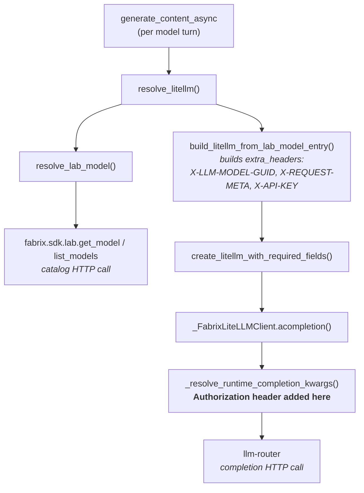

# Model calls as the user

How to make every FabriX model call run under the identity of the person who made the request, instead of under the developer's `fadk login` credential. What has to change, what each user needs to have, what the container needs, and how to prove it works.

This is "Route A" from [DEPLOYMENT.md](DEPLOYMENT.md) and the open item at the bottom of [AUTHENTICATION_2.0.md](AUTHENTICATION_2.0.md), written out in full now that the FabriX model source has been read.

---

## Contents

1. [The idea in five sentences](#1-the-idea-in-five-sentences)
2. [What happens today, and why it is wrong](#2-what-happens-today-and-why-it-is-wrong)
3. [How FabriX actually resolves a model](#3-how-fabrix-actually-resolves-a-model)
4. [The seam](#4-the-seam)
5. [What credentials each user needs](#5-what-credentials-each-user-needs)
6. [What the server needs](#6-what-the-server-needs)
7. [Implementation](#7-implementation)
8. [Which code paths are covered](#8-which-code-paths-are-covered)
9. [Token lifetime and long runs](#9-token-lifetime-and-long-runs)
10. [Testing it](#10-testing-it)
11. [Failure modes: symptom → cause → fix](#11-failure-modes-symptom--cause--fix)
12. [Tests in this repo](#12-tests-in-this-repo)
13. [Still to confirm from the FabriX package](#13-still-to-confirm-from-the-fabrix-package)
14. [If pass-through cannot be used](#14-if-pass-through-cannot-be-used)
15. [Checklist](#15-checklist)

---

## 1. The idea in five sentences

Every request to this backend already carries a **Fabrix access token** — the same kind of token `fadk login` stores, issued by the same Keycloak realm and the same client. FabriX resolves a model **during the request**, not at import time, and it fetches the bearer token for that resolution from a **single function**, every single time. So making model calls run as the caller is not a redesign: it is replacing that one function with one that prefers the token already sitting in the `current_fabrix_token` contextvar. The agents, the `Runner`, and every `build_model(...)` line stay exactly as they are. The result is a container that needs **no FabriX credential of its own** — credentials arrive with each request, and usage is metered against the real user.

---

## 2. What happens today, and why it is wrong

`POST /apps/users/{user_id}/sessions/{session_id}/run` authenticates the caller correctly, checks that `{user_id}` is really them, and then calls the model **as whoever last ran `fadk login` on the host**.

That has two consequences:

| Where | What you see |
|---|---|
| Your laptop | Everything works. Every user's tokens, quota, and asset permissions are yours. A colleague calling the API consumes your allowance and reaches models *you* can reach, not models *they* can reach. |
| A container | `/health` is green, the app boots, and the **first model call fails**. A fresh container has never run `fadk login`, so there is no `auth.json` to read. |

Mounting a host's `auth.json` into the container is not a fix: `fadk` stores a **session-bound** refresh token (`typ: Refresh`, ~4 h idle, dies with the Keycloak SSO session), so the container would go dark a few hours after every login.

The seam to fix it has been in place since the auth work landed but was never connected — [dependencies.py:82](data_agent/dependencies.py#L82):

```python
current_fabrix_token.set(user.token)
```

Nothing reads it. This document connects it.

---

## 3. How FabriX actually resolves a model

This is the part that makes the change small, and it is worth understanding before writing any code.

`build_model()` does **not** build a model. It returns a `DeferredFabrixModel` — its own docstring says *"deploy-safe FabriX model that resolves Lab metadata during execution."* The constructor stores strings and performs no network call and no credential lookup:

```python
def build_model(model_name_or_id="", *, model_type="text", request_meta=None, model_config=None, **kwargs):
    return DeferredFabrixModel(
        model=_clean_str(model_name_or_id),
        lab_id=_resolve_runtime_lab_id(allow_empty=True),
        ...
    )
```

Everything real happens inside `resolve_litellm()`, which `DeferredFabrixModel` calls on **every** `generate_content_async`:



Two things follow from this, and both are good news:

**The whole chain runs inside your request.** `resolve_litellm()` is called per turn, not cached on the model object. Whatever contextvar is live when the endpoint runs is live when the token is fetched.

**The `Authorization` header is not baked in at build time.** `build_litellm_from_lab_model_entry` assembles `extra_headers` with only `X-LLM-MODEL-GUID`, optionally `X-REQUEST-META`, and optionally `X-API-KEY` — no `Authorization`. But `lite_llm.py` declares:

```python
REQUIRED_EXTRA_HEADER_KEYS = (HEADER_MODEL_GUID, HEADER_AUTHORIZATION, HEADER_REQUEST_META)
```

so it is filled in later, per completion, by `_resolve_runtime_completion_kwargs` inside `_FabrixLiteLLMClient._prepare_completion`.

> Note the layering: `X-API-KEY` is an **asset** key that FabriX reads from the model's own metadata (`_find_optional_model_attr_value(detail_data, "api_key")`). It identifies the *model*, not the person. The **`Authorization`** header is what identifies the *user*. Only the latter is what this document changes.

---

## 4. The seam

`lite_llm.py` imports exactly two auth helpers:

```python
from fabrix.common.auth import ensure_local_runtime_auth_context
from fabrix.common.auth import get_runtime_auth_token
```

`get_runtime_auth_token()` is what reads `auth.json`. Replace it, and every model call — and, if the catalog client shares it, every catalog lookup too — carries the caller's token instead.

**There is one trap, and it will silently defeat a naive patch.** That is a `from … import …`, which copies the function object into the `fabrix.adk.models.lite_llm` namespace. Rebinding `fabrix.common.auth.get_runtime_auth_token` afterwards does **not** reach that copy. Worse, the import is lazy and its timing is hard to predict:

- `fabrix/adk/models/__init__.py` exposes everything through `__getattr__`, so importing it pulls in *nothing*.
- `lab_model_catalog.py` imports `lite_llm` lazily, inside `create_litellm_with_required_fields`.

So `lite_llm` may be loaded before or after your patch depending on what ran first. The install routine below handles both directions: it replaces the source binding *and* sweeps `sys.modules` for any FabriX module already holding a copy.

---

## 5. What credentials each user needs

Nothing is stored per user on the server. Everything travels in the request. But the user's account must satisfy all of the following, and the last two are **not** things this repository can grant.

| # | Requirement | Where it comes from | What breaks without it |
|---|---|---|---|
| 1 | An account in the Keycloak realm `fabrix` | Samsung SSO | Cannot sign in at all |
| 2 | A valid, unexpired **access token** | `GET /auth/login` in a browser, or `fadk login` for testing | `401` from this backend |
| 3 | The `sub` claim | Inside the token | It *is* the `user_id` in every `/apps/users/{user_id}/…` path; a mismatch is `403` ([dependencies.py:86](data_agent/dependencies.py#L86)) |
| 4 | A `tenant_id` matching the lab's tenant | Inside the token (`tenant_id`, `tenants`, `tenant_code`) | Catalog lookups resolve against the wrong tenant |
| 5 | Membership of the lab named by `LAB_ID` | FabriX platform | `model_not_found` when the catalog is listed |
| 6 | Rights to use the model asset `MODEL_NAME_OR_ID` | FabriX platform (asset sharing / use-request approval) | `model_not_found`, or a `401`/`403` from the llm-router |

Requirements 5 and 6 are the ones to verify **before** writing code, because today they are invisible: your own account has them, so nothing fails. Section 10 shows how to test with a second user.

### What the token looks like

Decoding a real token from `fadk login` — the same shape a user gets from `/auth/login`:

```
iss:                https://genai.sec.samsung.net/iam-keycloak/realms/fabrix
azp:                fabrix-adk
typ:                Bearer
scope:              openid email profile
sub:                05dc3850-3bdf-4225-83a2-d45729a17f73     ← the user_id
tenant_id:          1
tenant_code:        dxhq
lifetime:           4200s  (70 minutes)
realm_access.roles: [default-roles-fabrix, offline_access, uma_authorization]
permission:         [perm_user, perm_read_lab, perm_create_lab, … 30 entries]
```

The access token carries **no `aud` claim at all**, which is why [auth_service.py:60](data_agent/services/auth_service.py#L60) sets `verify_aud: False` and why a `fadk login` token works against this API unchanged.

Note what is *not* in the 30 `permission` entries: there is no `perm_invoke_model` or equivalent. Model access is not decided by a claim in the token — it is decided **asset-side**, by the llm-router, against the identity the token proves. That is precisely why pass-through is the correct design: the platform can only enforce per-user model rights if it receives per-user tokens.

### What the user does *not* need

- No `fadk` installation, and no `fadk login`. The browser flow at `/auth/login` produces the same token.
- No separate API key. `X-API-KEY` is the model asset's own key, resolved server-side from asset metadata.
- No stored refresh token on the server. Refresh is the client's job, through `POST /auth/refresh`.

---

## 6. What the server needs

After this change, the container needs **no FabriX user credential** — no `auth.json`, no `fadk login`, no client secret. It does need three pieces of runtime configuration that FabriX reads from the process environment.

| Variable | Read by | Required? | Notes |
|---|---|---|---|
| `LAB_ID` | `_resolve_runtime_lab_id()` | **Yes** | `resolve_litellm()` calls it with `allow_empty=False` and raises `model_lab_id_required` if it is missing |
| `TENANT_CODE` | `_runtime_scope_cache_key()` | Recommended | Partitions the catalog caches |
| `BASE_URL` | `_runtime_scope_cache_key()` | Recommended | Partitions the catalog caches |

FabriX resolves the lab id as `get_core_settings().runtime.lab_id` **first**, then `os.getenv("LAB_ID")`. On your laptop the first one is populated by `fadk`, which is why nothing has ever failed there. A container has no `fadk` core settings, so the env var is the only source.

> **These three are already declared in this repo but never used.** [config.py:107-109](common/config.py#L107-L109) defines `lab_id`, `tenant_code`, and `base_url` on `Settings`, and [config.py:13-15](common/config.py#L13-L15) maps `LAB_ID` / `TENANT_CODE` / `BASE_URL` onto them — but no code reads `SETTINGS.lab_id`, and FabriX reads `os.environ`, not our `Settings` object. The two halves have never been joined. On top of that, [config.yaml:29-31](config.yaml#L29-L31) still holds literal placeholders — they parse as the **string `"..."`**, not as empty values, so they would be exported as garbage rather than falling back. Both need fixing; §7.3 does it.

### A caching note

`_LAB_MODEL_LIST_CACHE` and `_LAB_MODEL_DETAIL_CACHE` in `lab_model_catalog.py` are module-level, hold entries for one hour, and are keyed by `(tenant_code, base_url)` — **not by user**. So once any user has resolved a model, the catalog metadata is reused for everyone in that scope.

This is not a security hole in practice: the actual completion still carries each user's own `Authorization` header, so the llm-router enforces per-user model rights at the point that matters. What the cache bypasses is only the *catalog-read* check. If you want that per-user too, set `LAB_MODEL_DETAIL_CACHE_TTL_SECONDS=0` and `LAB_MODEL_LIST_CACHE_TTL_SECONDS=0` — at the cost of a catalog round trip on every model turn.

---

## 7. Implementation

### 7.1 The override module

Create `data_agent/agents/fabrix_credentials.py`:

```python
"""Make FabriX model calls run as the user who made the request.

FabriX resolves a model during the request -- catalog lookup and completion alike --
and reads the bearer token from ``fabrix.common.auth.get_runtime_auth_token`` every
time. Replacing that one function turns a server-wide identity into a per-user one
without touching the agents, the runners, or any ``build_model`` call.
"""
import importlib
import logging
import sys

import fabrix.common.auth as fabrix_auth

# Imported from the module, not the package: ``data_agent.services.__init__`` pulls in
# ``agent_runner``, which imports ``data_agent.agents``, which imports this file. Going
# through the package would deadlock on a half-initialised __init__.
from data_agent.services.auth_service import current_fabrix_token

logger = logging.getLogger(__name__)

_original_get_runtime_auth_token = fabrix_auth.get_runtime_auth_token


def _get_runtime_auth_token(*args, **kwargs):
    """The caller's own token while a request is in flight, the host's otherwise.

    The fallback is what keeps ``auth.enabled: false`` working: the dev stub user has
    an empty token, so local development still goes through the developer's own
    ``fadk login``.
    """
    return current_fabrix_token.get() or _original_get_runtime_auth_token(*args, **kwargs)


def install() -> None:
    """Point every FabriX token lookup at the current request's user.

    ``lite_llm`` binds the name with ``from fabrix.common.auth import
    get_runtime_auth_token``, so replacing it on the source module alone misses any
    module that already copied it. The import forces the lazy
    ``fabrix.adk.models.__getattr__`` to load that module, and the sweep then rebinds
    every copy FabriX is holding.
    """
    fabrix_auth.get_runtime_auth_token = _get_runtime_auth_token

    try:
        importlib.import_module("fabrix.adk.models.lite_llm")
    except ImportError:
        logger.warning("fabrix.adk.models.lite_llm is not importable; only the source binding was replaced")

    rebound = ["fabrix.common.auth"]
    for name, module in list(sys.modules.items()):
        if not name.startswith("fabrix.") or module is None:
            continue
        if getattr(module, "get_runtime_auth_token", None) is _original_get_runtime_auth_token:
            module.get_runtime_auth_token = _get_runtime_auth_token
            rebound.append(name)

    logger.info(f"FabriX model calls now run as the requesting user; rebound in {rebound}")
```

Three details in there are not optional:

**The import is `from data_agent.services.auth_service import …`, not `from data_agent.services import …`.** [services/\_\_init\_\_.py:1](data_agent/services/__init__.py#L1) imports `agent_runner`, which imports `data_agent.agents` at [agent_runner.py:12](data_agent/services/agent_runner.py#L12), which imports this module. Going through the package would hit a partially executed `__init__` and raise `ImportError: cannot import name 'current_fabrix_token'`.

**The `or` fallback is what preserves dev mode.** With `auth.enabled: false`, [dependencies.py:64](data_agent/dependencies.py#L64) returns a stub user whose `token` is `""`, and `current_fabrix_token` is set to that empty string — not to `None`. `or` treats both the same and falls through to the original.

**The sweep is the safety net.** It catches `lite_llm` regardless of import order, and it also catches any *other* FabriX module — `fabrix.sdk.lab`, for instance — that from-imported the same function. The log line names what it rebound, which is your evidence the patch actually landed.

### 7.2 Wiring it in

[data_agent/agents/\_\_init\_\_.py](data_agent/agents/__init__.py) becomes:

```python
from data_agent.agents.fabrix_credentials import install as install_per_user_credentials

install_per_user_credentials()

from .root_orchestrator import agent_app  # noqa: E402
from .system_agent import system_app  # noqa: E402
```

This is the right place because it is the single door every agent goes through, it runs at import — long before any request — and it covers tests and any future entry point without further thought. The `# noqa: E402` comments are load-bearing: the install genuinely has to precede the agent imports, so the linter's complaint is wrong here.

### 7.3 Exporting the runtime configuration

FabriX reads `os.environ`; this repo parses into `SETTINGS`. Join them. Add to `data_agent/agents/fabrix_credentials.py`:

```python
import os

from common.config import SETTINGS

# config.yaml ships these as literal "..." placeholders, which parse as a string and
# would otherwise be exported as a real (wrong) value.
_PLACEHOLDER = "..."


def export_runtime_env() -> None:
    """Publish the FabriX runtime settings where fabrix-adk looks for them.

    ``_resolve_runtime_lab_id`` checks fabrix core settings first and ``os.getenv``
    second, so on a machine with ``fadk`` configured this changes nothing. In a
    container it is the only source.
    """
    for env_name, value in (
        ("LAB_ID", SETTINGS.lab_id),
        ("TENANT_CODE", SETTINGS.tenant_code),
        ("BASE_URL", SETTINGS.base_url),
    ):
        if value and value != _PLACEHOLDER:
            os.environ.setdefault(env_name, value)
        else:
            logger.warning(f"{env_name} is not configured; FabriX model resolution will fail without it")
```

and call it alongside the install:

```python
from data_agent.agents.fabrix_credentials import export_runtime_env, install as install_per_user_credentials

export_runtime_env()
install_per_user_credentials()

from .root_orchestrator import agent_app  # noqa: E402
from .system_agent import system_app  # noqa: E402
```

`setdefault` rather than assignment, so a real environment variable set by the deployment always wins over the YAML.

Then put real values in [config.yaml](config.yaml) in place of the `...` placeholders, and add the pass-throughs to your `docker run`:

```bash
-e LAB_ID=<the lab that owns the model asset>
-e TENANT_CODE=dxhq
-e BASE_URL=<fabrix platform base url>
```

### 7.4 What does not change

Worth stating explicitly, because it is the point of the design:

- **No change to any agent.** [root_orchestrator.py:13](data_agent/agents/root_orchestrator.py#L13), [milvus_scanner.py:11](data_agent/agents/milvus_scanner.py#L11), [mongodb_scanner.py:10](data_agent/agents/mongodb_scanner.py#L10), [system_agent.py:8](data_agent/agents/system_agent.py#L8) keep their module-level `build_model(...)` calls. `DeferredFabrixModel` is already per-request.
- **No change to the runners.** The `Runner` in [agent_runner.py:36](data_agent/services/agent_runner.py#L36) and the one in [system_runner.py:16](data_agent/services/system_runner.py#L16) stay as long-lived singletons.
- **No per-request model construction, no model cache, no `BaseLlm` subclass of our own.**
- **No change to `dependencies.py`.** The contextvar is already set in the right place.

---

## 8. Which code paths are covered

A contextvar is only useful if it is actually visible where the model gets called. Every model call in this codebase is downstream of an authenticated request, so all of them are covered:

| Path | Enters through | Token visible? | Why |
|---|---|---|---|
| `POST …/run` → root orchestrator → sub-agents | `require_path_user` on [runner.py:13](data_agent/routers/runner.py#L13) | Yes | The dependency and the endpoint run in the same task, so the same context |
| `POST …/title` → system agent | `require_path_user` on [session.py:13](data_agent/routers/session.py#L13) | Yes | Same task |
| `PATCH …/title` (rename) | `require_path_user` | N/A | No model call — it writes a supplied string |
| Background `ensure_session_title` after a run | `asyncio.create_task` at [agent_runner.py:49](data_agent/services/agent_runner.py#L49) | **Yes** | `create_task` copies the current context into the new task at creation time |
| Lifespan startup (`get_agent_runner()`, [\_\_main\_\_.py:22](data_agent/__main__.py#L22)) | — | No | It only constructs objects; no model call happens |

That fourth row resolves the caveat left open in [DEPLOYMENT.md](DEPLOYMENT.md) — *"server-initiated work with no request context still needs some credential."* It turns out there is no such work here. `_schedule_session_title` fires while the request's context is still current, `create_task` snapshots it, and the background titling therefore runs with the same user's token even though the HTTP response has already been sent.

> **Do not turn `get_current_user` into a sync `def`.** It is `async def` at [dependencies.py:59](data_agent/dependencies.py#L59), so FastAPI awaits it inside the request's own task and `current_fabrix_token.set(...)` is visible to everything downstream. A sync dependency is run by Starlette in a worker thread through `anyio.to_thread.run_sync`, which copies the context *into* the thread and discards changes on the way out — the `set` would be silently lost and every user would quietly fall back to the host credential again.

---

## 9. Token lifetime and long runs

A Fabrix access token lives **4200 seconds (70 minutes)**. The token captured at the start of a request is the one used for every model turn in that request, including the background titling that follows it.

That is comfortably longer than any agent run this service performs, but the failure mode is worth knowing: if a run begins with only seconds left on the token, a later model turn gets a `401` from the llm-router even though this backend accepted the request. The `exp` is available as `CurrentUser.expires_at` ([schemas/auth.py:11](data_agent/schemas/auth.py#L11)) if you ever want to log a warning or refuse a run below some remaining-lifetime threshold.

The real mitigation is on the client, and it is already specified in [AUTHENTICATION_2.0.md §7](AUTHENTICATION_2.0.md): refresh proactively at `expires_in - 60`, and retry once through `/auth/refresh` on any `401`.

Refresh remains entirely the client's job. This backend never stores a refresh token and never renews anything on a user's behalf.

---

## 10. Testing it

### Step 1 — prove the header actually changes

FabriX logs the resolved request headers, sanitized, at `DEBUG`:

```python
logger.debug("LiteLlm request headers resolved. model=%s headers=%s", resolved_model, sanitize_headers_for_log(...))
```

Set `LOG_LEVEL=DEBUG`, make one `/run` call, and find that line. Also confirm the install log from §7.1 appears at startup and names `fabrix.adk.models.lite_llm` among the rebound modules — if it names only `fabrix.common.auth`, the sweep found nothing and you should check whether the module loads later than you think.

### Step 2 — prove it is not silently using your `auth.json`

The decisive test. Move your credential aside so there is nothing to fall back to:

```powershell
Rename-Item "$env:USERPROFILE\.config\fadk\dxhq\auth.json" auth.json.bak
```

Restart the backend with `auth.enabled: true`, get a token through `/auth/login`, and run an agent request. If it succeeds, the model call is running purely on the request's token — which is exactly what the container will do. Restore the file afterwards.

### Step 3 — prove it is per-user, with a second user

This is the test that catches requirements 5 and 6 from §5, and there is no substitute for it.

```powershell
$t = "<colleague's access token>"
# 1. who does the platform think they are?
curl.exe -s -H "Authorization: Bearer $t" http://localhost:53862/auth/me
# 2. create a session as them, using the id from step 1
curl.exe -s -X POST -H "Authorization: Bearer $t" http://localhost:53862/apps/users/<their-id>/sessions
# 3. run the agent as them
curl.exe -s -X POST -H "Authorization: Bearer $t" `
  -F "query=list the collections" `
  http://localhost:53862/apps/users/<their-id>/sessions/<sid>/run
```

Then compare `tenant_id` in their `/auth/me` response against yours. A different tenant means the lab and the model asset resolve differently for them, and step 3 will fail regardless of how correct the code is.

### Step 4 — check the metering

Ask the FabriX platform team, or look at whatever usage view the platform exposes, and confirm the calls are now attributed to each caller rather than all to you. That is the whole business point of the change; it is worth verifying rather than assuming.

---

## 11. Failure modes: symptom → cause → fix

| What you see | What it actually means | Fix |
|---|---|---|
| `InputValidationError: model_lab_id_required` | `LAB_ID` is unset and FabriX core settings are absent — the normal container symptom | Set `LAB_ID`; check `export_runtime_env()` ran and that `config.yaml` no longer holds `...` |
| `model_not_found` for a model UUID you know exists | **Usually authorization, not a bad id.** The UUID triggers `_resolve_lab_model_by_id_fast_path`, whose `except Exception: return None` swallows the real error; it then falls through to listing the models the user *can* see, doesn't find the UUID, and reports "not found" | Confirm the user is in the lab and the model asset is shared with them. To see the true error, call `fabrix.sdk.lab.get_model(<uuid>)` directly with their token |
| Calls still metered to you after the change | The patch did not reach `lite_llm`'s copy of the function, or `install()` ran after the first model call | Check the startup log line from §7.1 lists `fabrix.adk.models.lite_llm` |
| `401` from the llm-router mid-run, request itself was fine | The user's access token expired during the run (70 min) | Client-side proactive refresh; see §9 |
| Works locally, fails in the container | Still falling back to `auth.json` locally and there is none in the container | Run the §10 step 2 test — it is designed to catch exactly this before deploy |
| Everything fails locally with an auth error after enabling this | `auth.enabled: false`, so the token is `""`, so it fell back to `auth.json` — and you have not run `fadk login` recently | `fadk login`, or set `auth.enabled: true` and use a real token |
| `RequestContextUnavailableError` | FabriX wanted a runtime context that neither our contextvar nor `auth.json` satisfied | See §13 — this is the `ensure_local_runtime_auth_context` unknown |
| One user's model works, another's returns stale metadata | The catalog caches are shared across users for an hour (§6) | `LAB_MODEL_DETAIL_CACHE_TTL_SECONDS=0`, `LAB_MODEL_LIST_CACHE_TTL_SECONDS=0` |

---

## 12. Tests in this repo

[tests/conftest.py:171](tests/conftest.py#L171) installs a stub FabriX package so the import graph resolves without the real one — it currently provides `fabrix.adk.models.build_model` and `fabrix.adk.runtime.create_runtime_app` only. Once `data_agent/agents/__init__.py` calls `install()`, the stub needs two more pieces:

- a `fabrix.common.auth` module exposing a `get_runtime_auth_token` callable, and
- a `fabrix.adk.models.lite_llm` module (it may be empty — `importlib.import_module` only has to succeed).

Worth adding as real tests:

| Test | Asserts |
|---|---|
| Token set → override returns it | `current_fabrix_token.set("abc")`, call the patched function, expect `"abc"` |
| Token empty → falls back | Empty string and `None` both reach the original function |
| Install rebinds a from-imported copy | Create a module holding a copy of the original, run `install()`, assert it now holds the replacement |
| Context reaches a background task | Set the var, `asyncio.create_task` a coroutine that reads it, assert the value survives |
| `export_runtime_env` ignores `"..."` | Placeholder values do not land in `os.environ` |

---

## 13. Still to confirm from the FabriX package

Three things could not be settled from the source read so far. None changes the shape of the design; all three could change details of the implementation.

| # | Question | File to read | Why it matters |
|---|---|---|---|
| 1 | Does `_resolve_runtime_completion_kwargs` call `get_runtime_auth_token` per completion, or memoize it? And what does `ensure_local_runtime_auth_context` do when there is no `auth.json`? | the tail of `fabrix/adk/models/lite_llm.py` | If it memoizes, one token could leak across users. If `ensure_local_runtime_auth_context` raises without a local credential, it may fail *before* the override is consulted, and would need handling too |
| 2 | What is the signature of `get_runtime_auth_token`, and does FabriX already expose a contextvar for this? | `fabrix/common/auth/__init__.py` | If FabriX has a supported per-request token hook, use it instead of monkeypatching |
| 3 | Do `get_model` / `list_models` authenticate through the same function? | `fabrix/sdk/lab.py` | If they use a separate client, the catalog calls still go out as the host and need a second patch point |

The `sys.modules` sweep in §7.1 already covers question 3 *if* `fabrix.sdk.lab` from-imports the same function. If it builds its own HTTP client with its own token lookup, that is a second override.

One further open item: `build_model` accepts a `request_meta` argument that becomes the `X-REQUEST-META` header, and `lite_llm.py` imports `get_request_meta` and `build_default_request_meta`. If the platform uses that header for usage attribution or tracing, it may also want per-user values — worth asking the platform team once pass-through works.

---

## 14. If pass-through cannot be used

Keep these in reserve. They solve "the container has no credential"; none of them solves "each user should be metered and authorized as themselves".

**An `offline_access` token.** Your Keycloak account already carries the `offline_access` realm role, but `fadk login` requests only `scope=openid profile email`, so it receives a session-bound `typ: Refresh` token that dies after ~4 h idle. Requesting the scope explicitly may yield a `typ: Offline` refresh token, which survives logout and idle expiry:

```
https://genai.sec.samsung.net/iam-keycloak/realms/fabrix/protocol/openid-connect/auth?response_type=code&client_id=fabrix-adk&redirect_uri=http%3A%2F%2Flocalhost%3A53862%2Fcallback&scope=openid+profile+email+offline_access&code_challenge=<challenge>&code_challenge_method=S256
```

Complete the login and decode the resulting refresh token: `typ: Offline` means it worked, and you have a credential you can inject as a container secret and refresh on a timer without involving the platform team. `typ: Refresh` means the client does not offer the scope and this route is closed. Either way it is one test. Caveat: it is still **one shared identity — yours** — and it is a credential that lives until revoked, so it must be an injected secret and never baked into an image.

**A service credential from the platform team.** Ask whether fabrix-adk supports a non-interactive service account or client-credentials grant configured through environment variables. If it exists, it is the cheapest correct answer for background work. Worth asking in the same message as the redirect-URI request in [AUTHENTICATION_2.0.md §8](AUTHENTICATION_2.0.md).

**`fadk build` / AgentOps.** The platform injects credentials itself, but it deploys a standard agent *workspace* — not this FastAPI application with its own routers, session store, and auth flow. See [DEPLOYMENT.md](DEPLOYMENT.md) Route C.

These compose with pass-through rather than replacing it: the `or` in `_get_runtime_auth_token` is exactly the place a service credential would sit as the fallback.

---

## 15. Checklist

- [ ] Model asset `MODEL_NAME_OR_ID` confirmed usable by a **second** user, not just you (§10 step 3).
- [ ] Second user's `tenant_id` matches the lab's tenant.
- [ ] `data_agent/agents/fabrix_credentials.py` added, importing from `data_agent.services.auth_service` (not the package).
- [ ] `install()` and `export_runtime_env()` called at the top of [data_agent/agents/\_\_init\_\_.py](data_agent/agents/__init__.py), before the agent imports.
- [ ] Startup log names `fabrix.adk.models.lite_llm` among the rebound modules.
- [ ] Real values in [config.yaml](config.yaml) for `lab_id`, `tenant_code`, `base_url` — the `...` placeholders are gone.
- [ ] `LAB_ID`, `TENANT_CODE`, `BASE_URL` passed to the container.
- [ ] Verified with `auth.json` renamed away (§10 step 2).
- [ ] `get_current_user` still `async def`.
- [ ] `auth.enabled: false` dev mode still works through the fallback.
- [ ] FabriX stub in [tests/conftest.py](tests/conftest.py) extended with `fabrix.common.auth` and `fabrix.adk.models.lite_llm`.
- [ ] The three open questions in §13 answered, and the implementation adjusted if they change anything.
- [ ] Usage confirmed as metered per user rather than all to one account.
